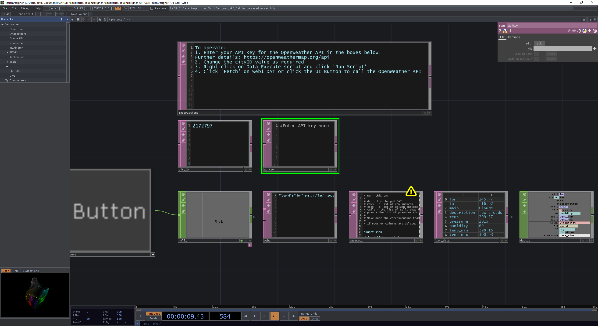

# TouchDesigner API Call
A repository demonstrating how to access REST APIs and parse JSON responses with TouchDesigner. 

To use the TOE file you will need to download [TouchDesigner](https://derivative.ca/) by Derivative. This can be used freely for non-commercial projects and education. You will also need to obtain an API key for the [OpenWeather API](https://openweathermap.org/api). In this example we retrieve the current weather conditions for [location by city ID](https://openweathermap.org/current). For example, `2172797` is the OpenWeather API city ID for London.

